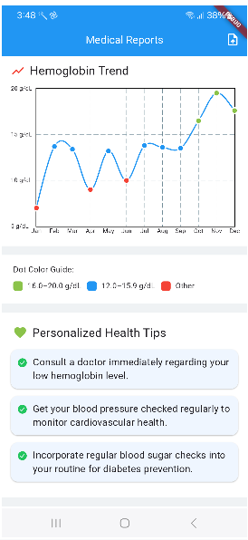

--

# Patient Report Summary

## **Title and Introduction**:
   - **Name**: Patient Report Summary
   - **Author**: Prakash Software Pvt Ltd
   - **Date**: 02 May 2025
   - **Purpose**: Display and summarize medical reports, including hemoglobin trends & health tips for patients.

## **Features**:
   - **Report Upload**: Users can upload medical reports in PDF format via an upload button in the app bar.
   - **Hemoglobin Trend**: Shows a graphical representation of hemoglobin levels over time with a color-coded dot guide.
   - **Health Tips**: Displays personalized health tips based on report metrics.
   - **Report List**: Lists all uploaded reports with details like hemoglobin, blood pressure, and sugar levels, styled with a colored strip indicating hemoglobin status.
   - **Animations**: Uses SVG icons for visual elements like report markers and upload buttons.
   - **Sections**: Organized into sections for hemoglobin trends, health tips, and my reports.

## **Tech Stack**:
   - **Flutter**: Built with Flutter for cross-platform compatibility (Android 7.0+).
   - **Dart**: Written in Dart, the programming language for Flutter.
   - **Flutter BLoC**: Manages app state and business logic for handling report data and UI updates.
   - **Gemini API**: Fetches analysis and health tips based on report data (assumed API for report processing).
   - **File Picker**: Handles PDF file uploads for medical reports.
   - **Flutter SVG**: Renders SVG icons for visual elements (e.g., upload button, report markers).
   - **FL Chart**: Displays hemoglobin trends in a line chart with interactive tooltips.
   - **Flutter Dotenv**: Loads environment variables (e.g., API keys) from a `.env` file.
   - **Shared Preferences**: Stores report data locally (assumed for persistence in `ReportService`).
   - **Flutter SVG**: Renders SVG icons for visual elements.

## **Getting Started**:
### Prerequisites
- **Flutter SDK**: Latest version (e.g., Flutter 3.19.x).
- **Dart**: Version 3.3 or higher (bundled with Flutter).
- **Gemini API Key**: Sign up at the Gemini API provider to get your API key (assumed API for report analysis).

### Steps
1. **Clone the Repository**:
   ```bash
   git clone <repository_url>
   cd patient-report-summary
   ```
2. **Add API Key**:
    - Open `assets/.env` in the project root.
    - Add your Gemini API key:
      ```properties
      GEMINI_API_KEY="your_api_key"
      ```
3. **Install Dependencies**:
    - Ensure Flutter is installed and set up.
    - Run the following command to fetch dependencies:
      ```bash
      flutter pub get
      ```
4. **Run the App**:
    - Connect an Android device or start an emulator.
    - Run the app with:
      ```bash
      flutter run
      ```

## **Screenshots**:
   